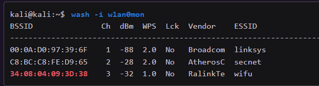

# 9. Attacking WPS Network

Use `wash -i wlan0mon` to scan for surrounding AP

can also use `airodump-ng` but `wash` is simpler 

to scan 5Ghz network, use `-5` 

- able to tell:
    - mac addr
    - channel
    - signal strength (the closer to 0 the better)
    - WPS version
        - if its wps 2.0, there is some measures put in place to slow down bruteforce
    - Lck indicates whether WPS is locked. if yes, its pointless
    - ESSID, the SSID of the AP

Use reaver to attack the AP. Have to specify BSSID of AP and specify interface and verbosity

`sudo reaver -b 34:08:04:09:3D:38 -i wlan0mon -v`

-b represents BSSID

-i represents interface

-v represents verbosity (add more v for more verbosity)

Brute forces all kinds of pin starting with **12345670** 

- checks the first half of the pin only first until it receives M5 message
- once that happens, proceeds to guess second half
- sometimes driver have trouble with reaver and wont switch channels to find AP
    - happens when reaver output stuck at “waiting for beacon from XX:XX:XX:XX:XX:XX”
    - to fix: add `-c <channel-id>` to specify channel
- can add `-K` to use PixieWPS attack, which will take a long time.

**Overcoming unexpected errors:**

- Attack choice
    - PixieWPS attack preferable to brute force whenever possible. Important to rmb that not all chipset random number generators are vulnerable. Often have to resort to brute forcing PIN
    - Brute forcing may sometimes be met with countermeasures from AP.
        - Use timing options to workaround

- WPS Transaction Failure
    - sometimes after finding PIN using pixieWPS, receive the following error
    
    
    
    - Could just be temp failure. Restart reaver without PixieWPS option to fix.
    - When restarting, reaver will prompt to restore prev session, which has the correct PIN
    - If still have error, try another WIFI card

- ACK Issues
    - reaver might keep trying same PIN when verbose mode set. When increased verbosity, can notice a dozen instances of following pair of messages
    
    
    
    - caused by WIFI card not ack frames sent by AP, makes AP retransmit a few times before giving up and trying again
    - might recognize this in packet capture when reaver does auth and association
    - to fix: try different wireless card w/ different chipset

- WPS Lock
    - WPS locked, can do DOS on AP using mdk3 or mdk4. Triggers reboot on AP which releases lock
    - can also auth DOS, EAPOL Start DOS, or EAPOL Logoff flood attack. Need multiple WIFI cards to overflow AP and crash AP to reboot